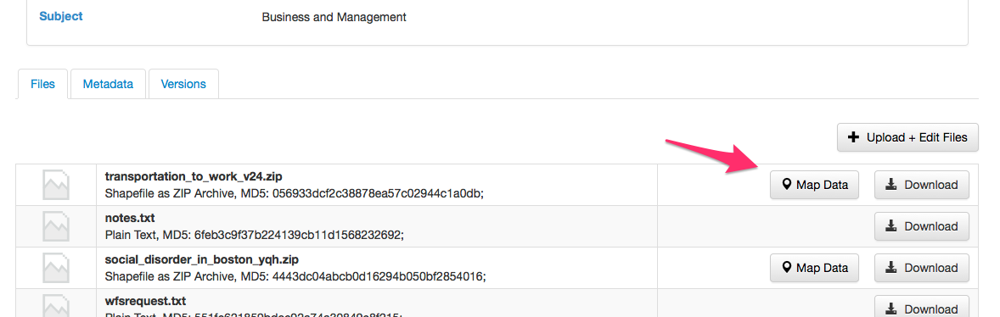

### Introduction

GeoConnect serves as an intermediate application between:

- [Dataverse](https://github.com/IQSS/dataverse) and 
- [WorldMap](https://github.com/cga-harvard/cga-worldmap).  

By using APIs on the Dataverse and WorldMap, GeoConnect provides the following broad functions:

1. Allows a Dataverse user to create a WorldMap map layer from a given Dataverse Datafile
    - Adds Dataverse information and links to the map layer metadata
    - Updates the Dataverse dataset with WorldMap metadata
1. Gives a Dataverse user the ability to style/classify the layer
    - In practical terms, styling involves choosing a variable, algorithm, and color to create a [chloropleth map](http://en.wikipedia.org/wiki/Choropleth_map)


The functionality is spread across 3 systems: Dataverse, GeoConnect, and the WorldMap.  The APIs are described below, system-by-system.

#### *Development Note*

*GeoConnect currently exists as a standalone web application.  An alternative method of implementing this functionality would be to build GeoConnect as an "app", directly using WorldMap functions rather than calling a custom built API.*

*However, at the time of this project, WorldMap was due for a major upgrade to [Geonode 2](http://geonode.org/2014/04/geonode-2-0/index.html).  Not knowing the timing of this upgrade, it was decided to implement functionality via API calls--with the thought of an easier transition once WorldMap was upgraded.  As of this writing, the Geonode 2 upgrade schedule has not been decided.*

*In addition, Dataverse is undergoing a full rewrite and the API "security" mechanism between GeoConnect and Dataverse is "evolving."*

#### mini-glossary

- DV = Dataverse
- WM = WorldMap

### Dataverse APIs 

#### api-dv01: Initiate "Map Data"


* API call template
```
GET {{ geoconnect_server }}/map-it/{{ token generated by Dataverse }}/?cb={{ dataverse_server }}/datafile/

* API call example
```
GET https://geoconnect.iq.datascience.harvard.edu/map-it/44404f5983ad8a72535991d5c5387f71d07310e9b4622ccd3d171d3dec28c174?cb=https://dvn-build.hmdc.harvard.edu/datafile/
```

* Purpose

Create and send a token to GeoConnect that relates to a specific DV datafile and DV user.  GeoConnnect may then use this token for future API calls:

    1.  Retrieve metadata about the given DV datafile
    1.  Request a copy of the actual file in order to map it
    1.  Send WorldMap related metadata back to Dataverse describing any Map layers created with the file.

* Token characteristics 
    1.  Restricted to a specific DV datafile and DV user.
    2.  The token has a "time-out" defined in the [TokenApplicationType.java](https://github.com/IQSS/dataverse/blob/master/src/main/java/edu/harvard/iq/dataverse/worldmapauth/TokenApplicationType.java) file
    3.  The token class itself is defined in [WorldMapToken.java](https://github.com/IQSS/dataverse/blob/master/src/main/java/edu/harvard/iq/dataverse/worldmapauth/WorldMapToken.java)

* Triggering event:

    - Dataverse: User presses the "Set-up/Map Data" button next to a Geospatial file. [](docs/images/commute_-_Root_Dataverse.png)
    - Note the "Set-up/Map Data" button goes to an internal url (e.g. https://dvn-build.hmdc.harvard.edu/api/worldmap/map-it/178/1) which triggers this sequence:
        1.  Token generated 
        1.  GET url created using token, e.g. ```GET {{ geoconnect_server }}/map-it/{{ token generated by Dataverse }}/?cb={{ dataverse_server }}/datafile/```
        2.  Page redirected to GET url
     
----     
     
* API call template
```
GET https://{{ dataverse_server }}/api/worldmap/map-it/{{ DV datafile id}}/{{ dv user id }}
   ```


